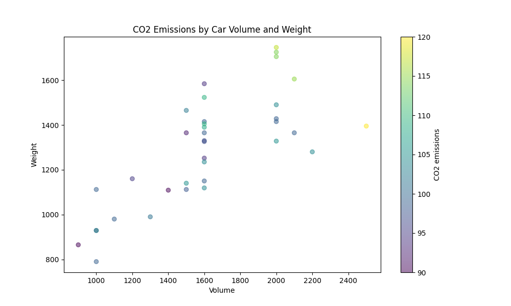

# CO2 Emission Prediction App 🌍💨


## Overview 🚀

This project is a web application that predicts CO2 emissions based on vehicle volume and weight. Built with Flask, the app uses a trained machine learning model to provide predictions and visualize the data, making it easy to understand the impact of vehicle specifications on emissions.

## Dataset 📊

The dataset used for this project was sourced from Kaggle. It contains information about various vehicles, including their volume, weight, and CO2 emissions. The data underwent a thorough cleaning process to ensure accuracy and reliability.

## Data Cleaning Process 🧹

The data cleaning process involved the following steps:

1. **Loading the Dataset:** The dataset was imported using Pandas.
2. **Handling Missing Values:** Rows with missing values in critical columns (Volume, Weight, CO2) were removed.
3. **Data Type Conversion:** Columns were converted to numeric types to ensure proper processing.
4. **Visualizing Data:** A scatter plot was created to illustrate the relationship between vehicle volume, weight, and CO2 emissions.



## Tech Stack 🛠️

Here are the technologies used in this project:

| Technology        | Logo                                                                 |
|-------------------|----------------------------------------------------------------------|
| **Frontend**      |  |
|                   |                   |
| **Backend**       |                   |
| **Machine Learning** |    |
| **Data Visualization** |                   |
| **Data Handling** |          |
| **Model Serialization** |            |

## Getting Started ⚙️

To run the application locally, follow these steps:

1. **Clone the Repository:**

   ```bash
   git clone https://github.com/yourusername/CO2-Emission-Prediction-App.git
   cd CO2-Emission-Prediction-App
